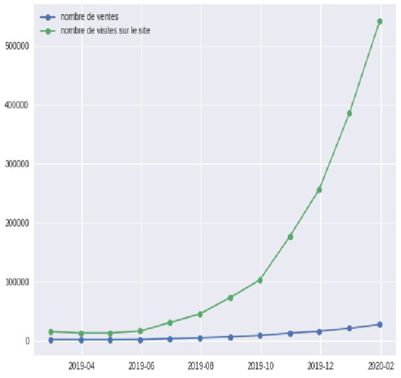

# Projet 2 — Analyse des ventes e-commerce

**Contexte :** Ajout d'une nouvelle gamme de produits → analyse du CA et de la nouvelle segmentation client, avec projection de tendance et préconisations : Comment la nouvelle gamme impacte-t-elle le chiffre d'affaires et la structure de la clientèle, et quelles actions en tirer ?

**Mots-clés :** saisonnalité · segmentation client · panier moyen · taux de conversion · série temporelle · prévision de CA · up-selling / cross-selling · fidélisation

**Compétences mobilisées :**

<table>
<colgroup>
<col style="width: 26%" />
<col style="width: 73%" />
</colgroup>
<thead>
<tr class="header">
<th>Domaine</th>
<th>Compétence</th>
</tr>
</thead>
<tbody>
<tr class="odd">
<td>Analyse statistique</td>
<td>Décomposition du CA (panier moyen × nb visites × taux de conversion)</td>
</tr>
<tr class="even">
<td>Analyse statistique</td>
<td>Détection de saisonnalité, analyse de séries temporelles</td>
</tr>
<tr class="odd">
<td>Data viz</td>
<td>Histogrammes empilés, boxplots, courbes temporelles (Python)</td>
</tr>
<tr class="even">
<td>Segmentation</td>
<td>Construction de segments clients (comportementaux/valeur)</td>
</tr>
<tr class="odd">
<td>Business / recommandation</td>
<td>
Traduction des insights en actions marketing :

ciblage, fidélisation, up-sell/cross-sell
</td>
</tr>
</tbody>
</table>

**Outils :** Python : pandas, matplotlib/seaborn

**Livrable :** Rapport d'analyse + préconisations commerciales

## Illustrations

<table width="100%" style="width:100%;table-layout:fixed;border-collapse:collapse;">
<tr>
<td width="25%" valign="top" style="width:25%;vertical-align:top;padding:4px;"></td>
<td width="25%" style="width:25%;"></td>
<td width="25%" style="width:25%;"></td>
<td width="25%" style="width:25%;"></td>
</tr>
</table>

## Document complet

[Portfolio (PDF)](../pdf/portfolio_keyword_v2.pdf)
