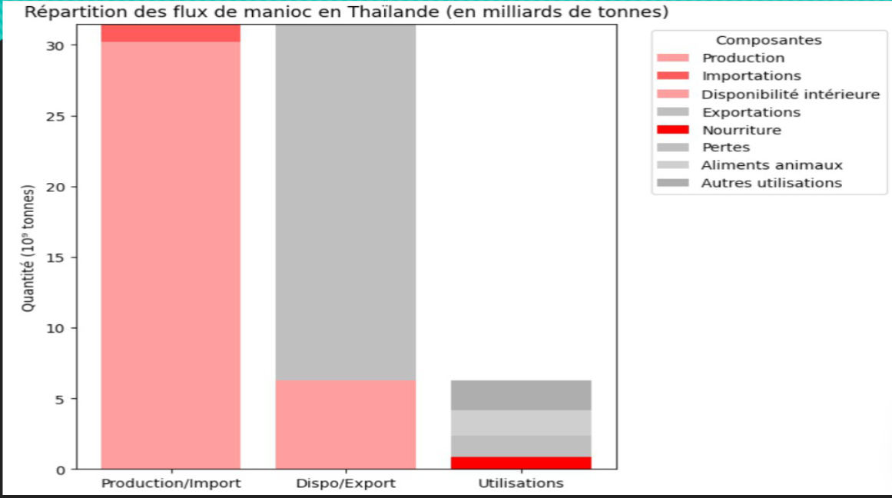
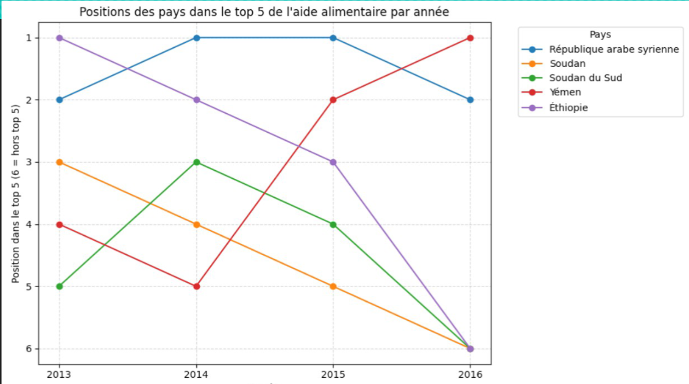

# Projet 3 — Étude FAO : alimentation dans le monde

**Contexte :** Analyse de la sous-nutrition mondiale (2013-2017) à partir de 4 bases FAO hétérogènes (disponibilité alimentaire, sous-nutrition, population, aide alimentaire), pour la santé publique / mission type OMS.

**Problématique :** La capacité mondiale à nourrir la population est-elle suffisante, et pourquoi la sous-nutrition persiste-t-elle malgré cela ? Étude de cas ciblée (manioc en Thaïlande).

**Mots-clés :** sous-nutrition · disponibilité alimentaire · kcal/jour/personne · aide alimentaire · jointure multi-sources · indicateurs macro-économiques · classement top 10 · étude de cas pays/produit · RGPD (non applicable)

**Compétences mobilisées :**

| Domaine                 | Compétence                                                                                                       |
|-------------------------|------------------------------------------------------------------------------------------------------------------|
| Préparation des données | Fusion/jointure de 4 bases hétérogènes (Zone/Année/Produit/Valeur) sous pandas                                   |
| Data viz                | Histogrammes empilés, podium (top/flop), diagramme spaghetti                                                     |
| Calcul d'indicateurs    | Construction d'indicateurs dérivés (kcal/j/p, taux de sous-nutrition, ratio nourriture/production)               |
| Agrégation              | Groupby par zone/produit/année, sommes pondérées (kcal disponibles)                                              |
| Analyse comparative     | Classements (sous-nutrition, aide alimentaire, disponibilité par habitant)                                       |
| Étude de cas            | Drill-down pays/produit (Thaïlande-manioc), croisement production/export/nourriture                              |
| Conformité              | Identification du périmètre RGPD                                                                                 |
| Synthèse                | Formulation de conclusions argumentées et de facteurs explicatifs multicausaux (logistique, politique, sécurité) |

**Outils :** Python (pandas), notebook Jupyter

**Livrable :** Notebook Python + rapport d'analyse avec conclusion

## Illustrations

<table width="100%" style="width:100%;table-layout:fixed;border-collapse:collapse;">
<tr>
<td width="25%" valign="top" style="width:25%;vertical-align:top;padding:4px;"></td>
<td width="25%" valign="top" style="width:25%;vertical-align:top;padding:4px;"></td>
<td width="25%" style="width:25%;"></td>
<td width="25%" style="width:25%;"></td>
</tr>
</table>

## Document complet

[Portfolio (PDF)](../pdf/portfolio_keyword_v2.pdf)
