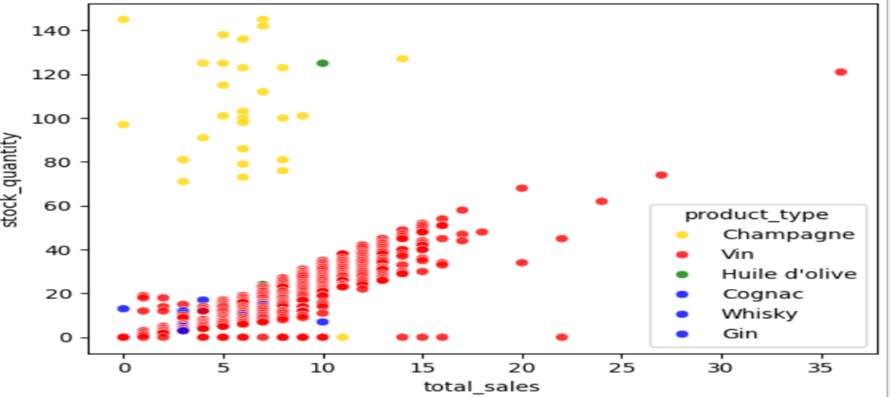
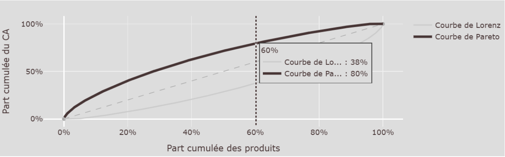
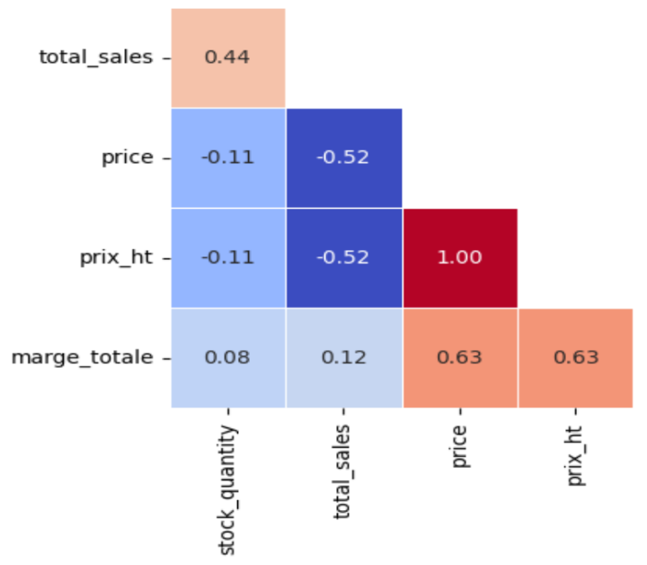
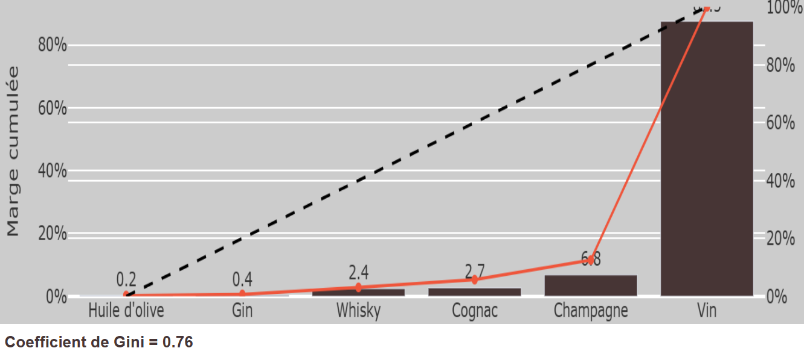

# Projet 6 — Bottleneck : ERP/Web e-commerce vins & champagnes

**Contexte :** Pour ESNData, fusion de deux systèmes (ERP prix/achat/stock et Web ventes/catégories) via jointure sur clés product_id/id_web, sur une fenêtre de données limitée.

**Problématique :** La qualité des données ERP/Web permet-elle une analyse fiable de la structure des ventes, et quels axes d'amélioration business (gestion de gamme, stock, marge) en tirer malgré une fenêtre réduite ?

**Mots-clés :** qualité de données · nettoyage · jointure de sources hétérogènes · feature engineering · détection d'outliers (IQR, z-score) · loi de Pareto (80/20) · coefficient de Gini · valorisation de stock · rotation de stock · saisonnalité · analyse de marge

**Compétences mobilisées :**

| Domaine             | Compétence                                                                                                                            |
|---------------------|---------------------------------------------------------------------------------------------------------------------------------------|
| Qualité des données | Audit structuré (comptage lignes/colonnes, doublons, valeurs manquantes, incohérences prix/stock) par table                           |
| Nettoyage           | Traitement différencié par type d'anomalie (suppression, correction à 0, filtrage par type produit), Archivage des lignes en erreurs. |
| Fusion de données   | Jointure de sources hétérogènes sur clé, contrôle du taux de perte à la jointure                                                      |
| Feature engineering | Création d'indicateurs dérivés (part de CA cumulée, cumul quantités, mois de stock, prix HT, marge totale)                            |
| Analyse statistique | Détection d'outliers par IQR et par z-score, interprétation métier des extrêmes (produits premium)                                    |
| Analyse business    | Analyse de concentration (Pareto 80/20) et d'inégalité (coefficient de Gini) sur CA, ventes et marge                                  |
| Analyse business    | Analyse de rotation de stock (mois de stock, flop 10, valorisation du stock)                                                          |
| Restitution         | Export de livrable exploitable (xlsx), recommandations priorisées, identification explicite des limites de l'étude                    |

**Outils :** Python (nettoyage/feature engineering), Excel

**Livrable :** Dataframe/fichier xlsx nettoyé et enrichi (714 lignes × 13 colonnes) + support de présentation avec analyses et recommandations

## Illustrations

<table width="100%" style="width:100%;table-layout:fixed;border-collapse:collapse;">
<tr>
<td width="25%" valign="top" style="width:25%;vertical-align:top;padding:4px;"></td>
<td width="25%" valign="top" style="width:25%;vertical-align:top;padding:4px;"></td>
<td width="25%" valign="top" style="width:25%;vertical-align:top;padding:4px;"></td>
<td width="25%" valign="top" style="width:25%;vertical-align:top;padding:4px;"></td>
</tr>
</table>

## Document complet

[Portfolio (PDF)](../pdf/portfolio_keyword_v2.pdf)
