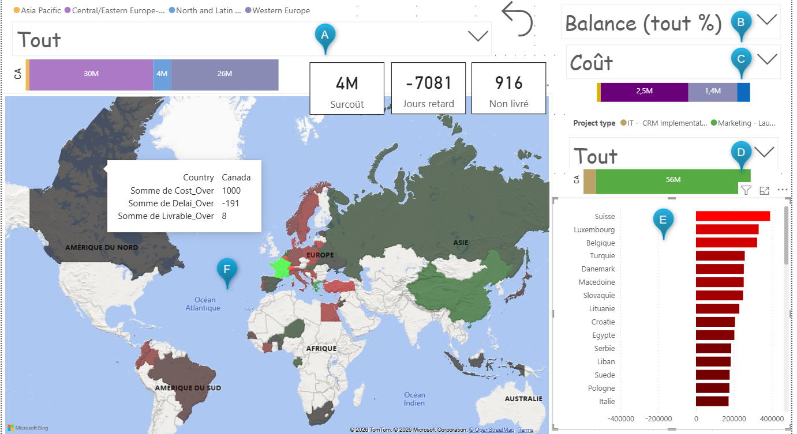
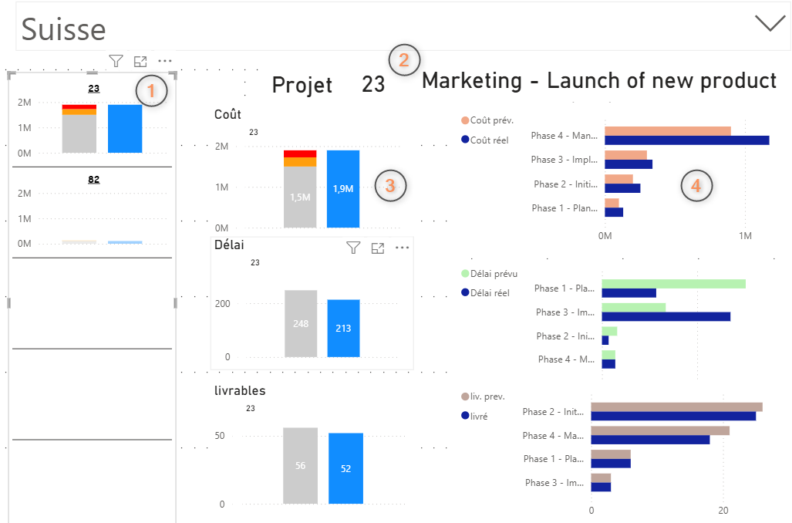
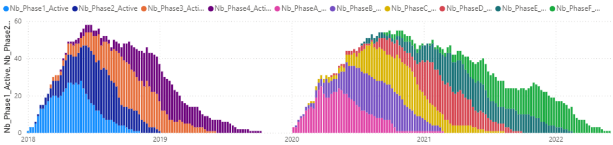
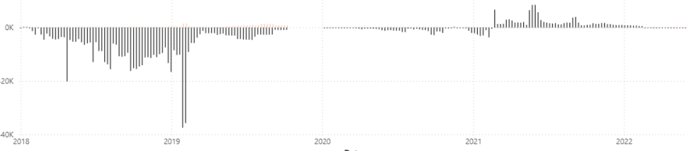

# Projet 7 — Power BI : suivi d'avancement de projets IT & Marketing

**Contexte :** Suivi international sur 4 ans de projets Marketing (4 phases) et IT (6 phases), avec alerte automatique dès 15 % d'écart prévisionnel/réel sur 3 KPI (livrables, durée, coût), pour 3 profils utilisateurs (DG, directeurs régionaux, directeurs de pays).

**Problématique :** Comment structurer et automatiser un modèle de données volumineux et hétérogène en schéma en étoile pour produire un tableau de bord multi-niveaux avec alerte dynamique, et personnalisé par rôle ?

**Mots-clés :** schéma en étoile · 3NF · Power Query · DAX · nettoyage dynamique · mesures/KPI · code couleur dynamique (alerte) · table calendrier · RLS/gestion des rôles · histogramme groupé et empilé · dette journalière

**Compétences mobilisées :**

| Domaine                    | Compétence                                                                                                                                  |
|----------------------------|---------------------------------------------------------------------------------------------------------------------------------------------|
| Modélisation de données    | Reconstruction d'un schéma en étoile normalisé (extraction de dimensions pays/région/projet, table de faits phases agrégée)                 |
| ETL                        | Nettoyage dynamique automatisé en Power Query, validation par tests d'automatisation                                                        |
| DAX                        | Écriture de mesures d'alerte (10 mesures intermédiaires, phases 1-4 et A-F), gestion de la compatibilité/maintenabilité du code             |
| DAX / modélisation avancée | Construction d'une table calendrier avec logique d'intervalle (phase active si date début \< jour \< date fin), optimisation de performance |
| Data viz                   | Codage couleur dynamique par niveau d'alerte (calcul manuel du dégradé — la carte choroplèthe étant trop limité)                            |
| Data viz                   | Histogrammes groupés/empilés avec caractérisation visuelle du dépassement (seuil 15 %)                                                      |
| UX / gouvernance           | Conception d'une interface multi-rôles avec restriction de périmètre (bridage régional), navigation par drill-down (pays → projet → phase)  |
| Indicateur métier          | Construction d'un indicateur composite ("dette journalière") pour mesurer l'écart cumulé prévisionnel/réel dans le temps                    |

**Outils :** Power BI, Power Query, DAX

**Livrable :** Tableau de bord Power BI multi-pages (vue globale/régionale, détail projet, vue temporelle) avec gestion des rôles

## Illustrations

<table width="100%" style="width:100%;table-layout:fixed;border-collapse:collapse;">
<tr>
<td width="25%" valign="top" style="width:25%;vertical-align:top;padding:4px;"></td>
<td width="25%" valign="top" style="width:25%;vertical-align:top;padding:4px;"></td>
<td width="25%" valign="top" style="width:25%;vertical-align:top;padding:4px;"></td>
<td width="25%" valign="top" style="width:25%;vertical-align:top;padding:4px;"></td>
</tr>
</table>

## Document complet

[Portfolio (PDF)](../pdf/portfolio_keyword_v2.pdf)
