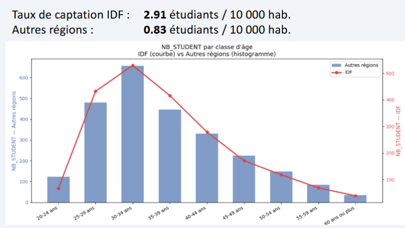
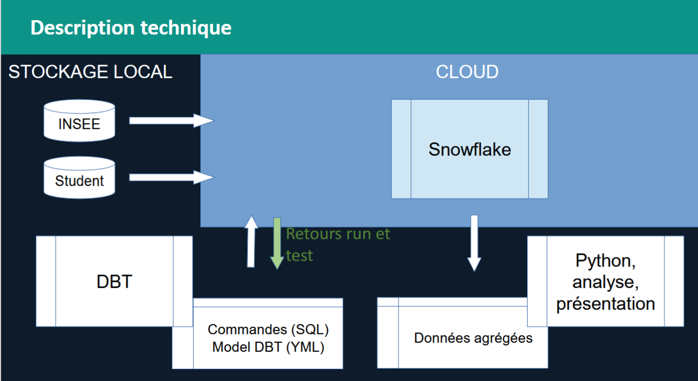

# Projet 8 — Analyse démographique des étudiants OpenClassrooms (dbt/Snowflake)

**Contexte :** Pipeline dbt/Snowflake sur 4 647 étudiants OpenClassrooms (2022-2025), enrichis par les données INSEE (population 2019), pour un profilage démographique et une analyse de captation par région.

**Problématique :** Qui sont les étudiants OpenClassrooms (âge, genre, région, évolution par promotion), et quels leviers de croissance/diversification en tirer pour le recrutement ?

**Mots-clés :** pipeline ELT · dbt · Snowflake · staging/marts · analyse univariée/multivariée · enrichissement démographique (INSEE) · taux de captation pour 10 000 habitants · Pareto · imputation de données manquantes · RGPD (minimisation, durée de conservation)

**Compétences mobilisées :**

| Domaine                           | Compétence                                                                                                                   |
|-----------------------------------|------------------------------------------------------------------------------------------------------------------------------|
| Ingénierie de données             | Pipeline ELT : import SQL dynamique vers Snowflake, transformation via modèles dbt (YAML), architecture staging → agrégation |
| Enrichissement de données         | Croisement avec données externes (population INSEE) , normalisation des volumes bruts en taux pour 10 000 habitants.         |
| Analyse statistique               | Analyse univariée (promotion, région, âge, genre) et multivariée (âge×promotion, genre×région)                               |
| Traitement des données manquantes | Imputation appliquée au croisement genre×région, quantification explicite du taux « genre » non-renseigné (26,8 %)           |
| Analyse business                  | Analyse de Pareto multi-variable (101 combinaisons/297 = 80 % des étudiants), identification de profil dominant              |
| Analyse comparative               | Benchmark vs moyenne nationale (parité femmes/hommes)                                                                        |
| Gouvernance des données           | Analyse RGPD post-publication (minimisation, durée de conservation des identifiants, registre des traitements)               |
| Restitution                       | Storytelling data avec recommandations stratégiques priorisées et numérotées                                                 |

**Outils :** SQL, dbt, Snowflake, Python

**Livrable :** Pipeline dbt versionné (GitHub). Présentation d'analyse avec recommandations

## Illustrations

<table width="100%" style="width:100%;table-layout:fixed;border-collapse:collapse;">
<tr>
<td width="25%" valign="top" style="width:25%;vertical-align:top;padding:4px;"></td>
<td width="25%" valign="top" style="width:25%;vertical-align:top;padding:4px;"></td>
<td width="25%" style="width:25%;"></td>
<td width="25%" style="width:25%;"></td>
</tr>
</table>

## Document complet

[Portfolio (PDF)](../pdf/portfolio_keyword_v2.pdf)
