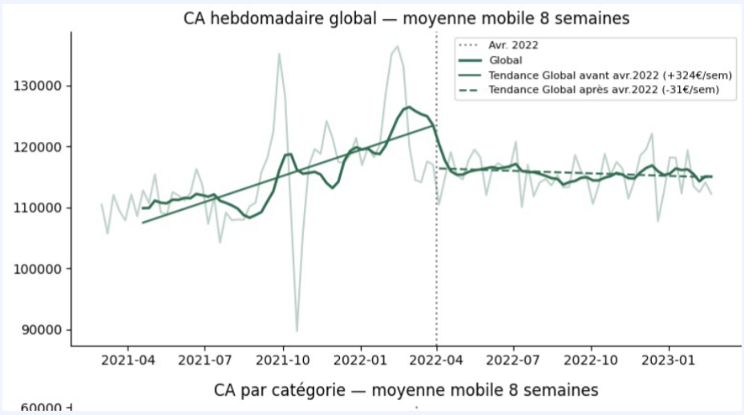
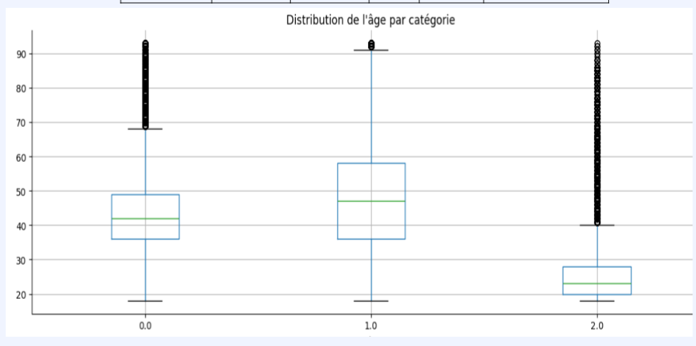
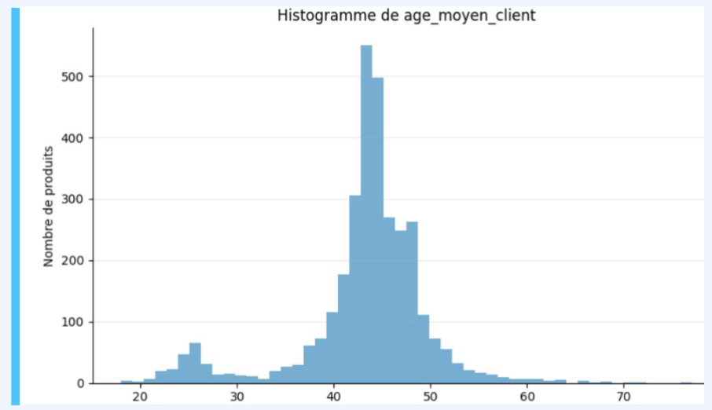
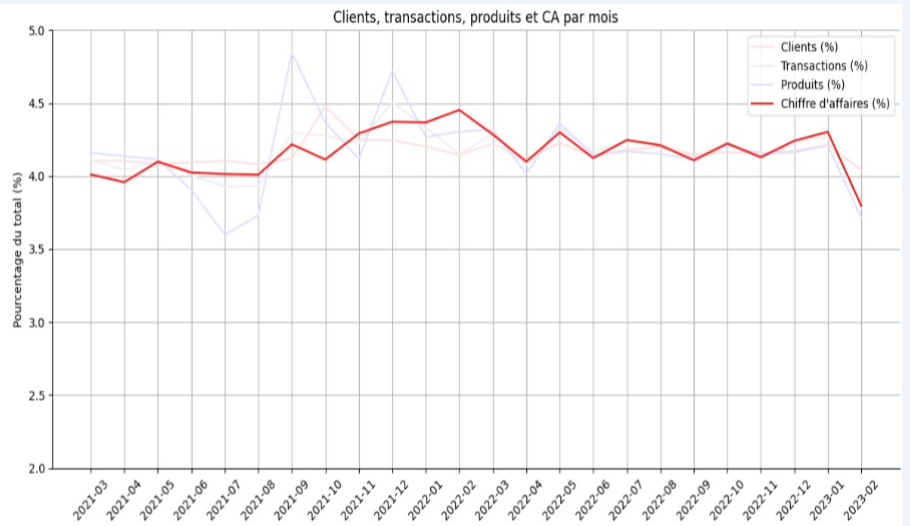

# Projet 9 — Lapage : indicateurs de vente et comportement client e-commerce

**Contexte :** Analyse de 24 mois d'activité d'un e-commerce de livres/produits culturels (Lapage), 8 621 clients, 3 286 produits, 687 534 transactions, incluant la caractérisation de segments B2B dans une base B2C.

**Problématique :** Quelle est la structure réelle du CA et de la clientèle (concentration, segments, tendances), et quelles anomalies (doublons, B2B non déclarés, churn) faut-il isoler pour ne pas biaiser l'analyse ?

**Mots-clés :** fusion multi-tables · qualité de données · doublons · moyenne mobile · régression par morceaux · loi de Pareto · coefficient de Gini · courbe de Lorenz · test du Chi² · Cramér's V · corrélation de Spearman · test de Kruskal-Wallis · eta carré · détection d'outliers · détection B2B · analyse de churn

**Compétences mobilisées :**

| Domaine                                    | Compétence                                                                                                             |
|--------------------------------------------|------------------------------------------------------------------------------------------------------------------------|
| Préparation des données                    | Fusion de 3 sources (clients, produits, sessions), suppression d'entités non liées, contrôle RGPD                      |
| Qualité des données                        | Détection d'anomalies structurelles (57 996 lignes dupliquées identifiées par clé composite id_client/timeOnly/année)  |
| Analyse statistique descriptive            | Répartition par catégorie, indicateurs clés par dimension (client, produit, session)                                   |
| Séries temporelles                         | Moyenne mobile pour lissage de tendance, régression par morceaux (détection de rupture de tendance mars 2022)          |
| Analyse de concentration                   | Pareto (2,9 %/20 %, 25,4 %/80 %), coefficient de Gini (0,688), courbe de Lorenz                                        |
| Statistiques inférentielles                | Test du Chi² + Cramér's V (association entre variables catégorielles, distinction significativité/taille d'effet)      |
| Statistiques inférentielles                | Corrélation de Spearman (âge vs CA, fréquence, panier moyen — non-paramétrique, cohérent avec données non gaussiennes) |
| Statistiques inférentielles                | Test de Kruskal-Wallis + eta carré (comparaison de médianes entre catégories, quantification de la taille d'effet)     |
| Détection d'outliers / segmentation métier | Identification de clients B2B par seuils de CA et de fréquence d'achat, distinction avec l'analyse B2C.                |
| Analyse de rétention                       | Analyse de churn / acquisition (dates de premier et dernier achat)                                                     |

**Outils :** Python (pandas, scipy)

**Livrable :** Rapport d'analyse avec dashboard de KPI, tests statistiques documentés, recommandations de segmentation

## Illustrations

<table width="100%" style="width:100%;table-layout:fixed;border-collapse:collapse;">
<tr>
<td width="25%" valign="top" style="width:25%;vertical-align:top;padding:4px;"></td>
<td width="25%" valign="top" style="width:25%;vertical-align:top;padding:4px;"></td>
<td width="25%" valign="top" style="width:25%;vertical-align:top;padding:4px;"></td>
<td width="25%" valign="top" style="width:25%;vertical-align:top;padding:4px;"></td>
</tr>
</table>

## Document complet

[Portfolio (PDF)](../pdf/portfolio_keyword_v2.pdf)
