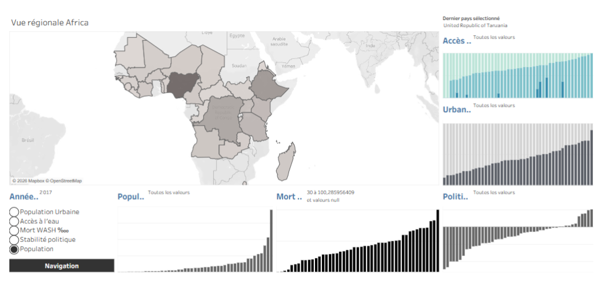
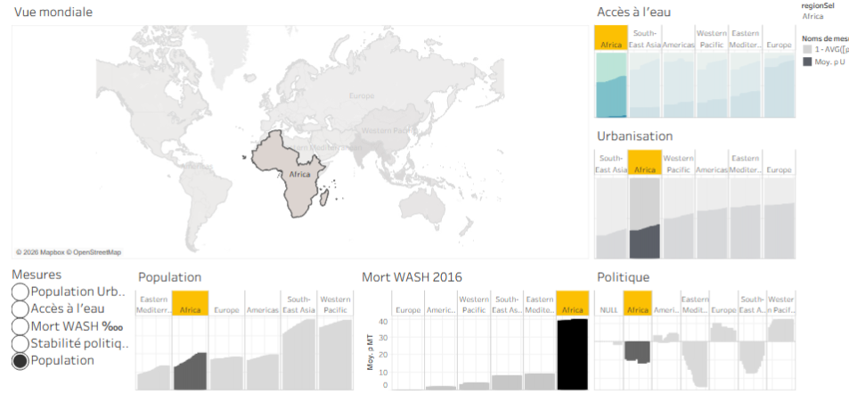
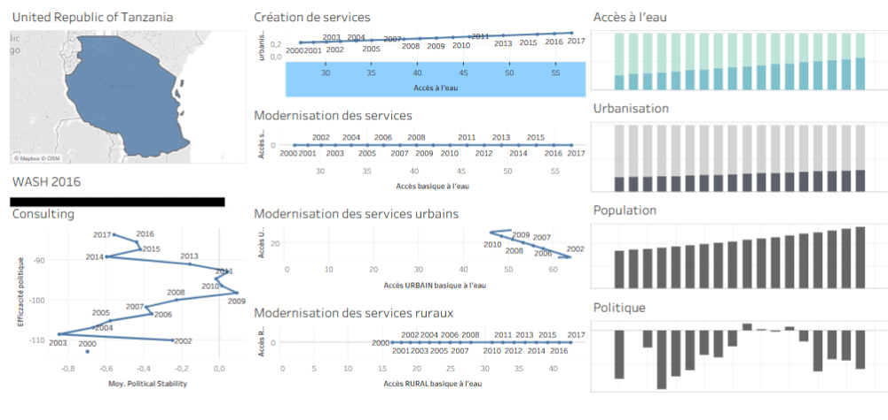

# Projet 10 — DWFA : dashboard Tableau sur l'accès à l'eau potable

**Contexte :** Mission de consulting pour l'ONG DWFA (accès à l'eau potable), en amont d'une décision d'investissement conditionnée à un financement, sur l'un de ses 3 domaines d'expertise (création de services, modernisation, consulting politique publique) dans un pays à déterminer.

**Problématique :** Quels pays présentent des difficultés d'accès à l'eau potable, et sur lesquels concentrer l'investissement, à travers un tableau de bord multi-niveaux (monde → continent → pays) couvrant les 3 domaines d'expertise ?

**Mots-clés :** cahier des charges client · brief de mission · sélection d'indicateurs · dashboard multi-niveaux (drill-down) · navigation par survol (hover) · carte géographique interactive · dégradé de couleur (heatmap) · Tableau Story · Tableau Public · accessibilité · dictionnaire de données · sources OMS/FAO

**Compétences mobilisées :**

| Domaine                 | Compétence                                                                                                                                                            |
|-------------------------|-----------------------------------------------------------------------------------------------------------------------------------------------------------------------|
| Cadrage de mission      | Traduction d'un brief client (mail + compte-rendu de réunion) en spécifications d'indicateurs et de vues                                                              |
| Sélection d'indicateurs | Choix d'indicateurs pertinents par domaine d'expertise (accès à l'eau, logistique, politique) à partir d'un dictionnaire de données et de sources externes (OMS, FAO) |
| Conception UX / dataviz | Conception d'un dashboard à 3 niveaux de granularité (monde/continent, continent/pays, détail pays) avec logique de drill-down cohérente                              |
| Conception UX / dataviz | Interaction par survol (highlight dynamique carte ↔ indicateurs périphériques), inspirée d'un modèle de référence (Harvard)                                           |
| Data viz                | Carte géographique avec dégradé de couleur d'intensité, disposition centrale carte + indicateurs en périphérie                                                        |
| Data viz                | Vue temporelle (évolution accès à l'eau potable / industrialisation) sur la page de détail pays                                                                       |
| Tableau                 | Construction d'une histoire Tableau (story), logique de navigation entre feuilles/niveaux                                                                             |
| Accessibilité           | Prise en compte de contraintes d'accessibilité dans la conception du dashboard                                                                                        |
| Publication             | Partage via Tableau Public                                                                                                                                            |

**Outils :** Tableau (Desktop + Public)

**Livrable :** Dashboard Tableau interactif à 3 vues (histoire Tableau), publié sur Tableau Public

## Illustrations

<table width="100%" style="width:100%;table-layout:fixed;border-collapse:collapse;">
<tr>
<td width="25%" valign="top" style="width:25%;vertical-align:top;padding:4px;"></td>
<td width="25%" valign="top" style="width:25%;vertical-align:top;padding:4px;"></td>
<td width="25%" valign="top" style="width:25%;vertical-align:top;padding:4px;"></td>
<td width="25%" style="width:25%;"></td>
</tr>
</table>

## Document complet

[Portfolio (PDF)](../pdf/portfolio_keyword_v2.pdf)
