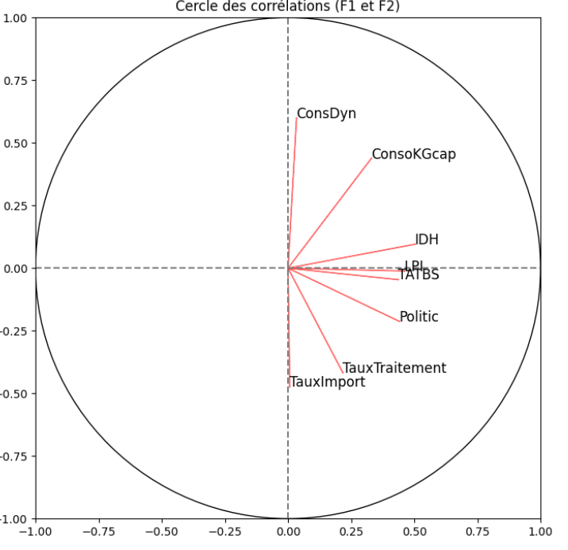
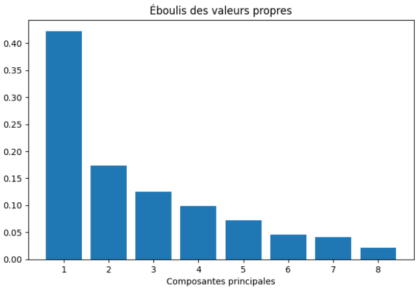
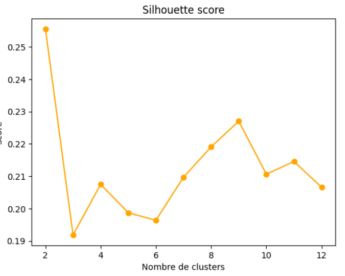
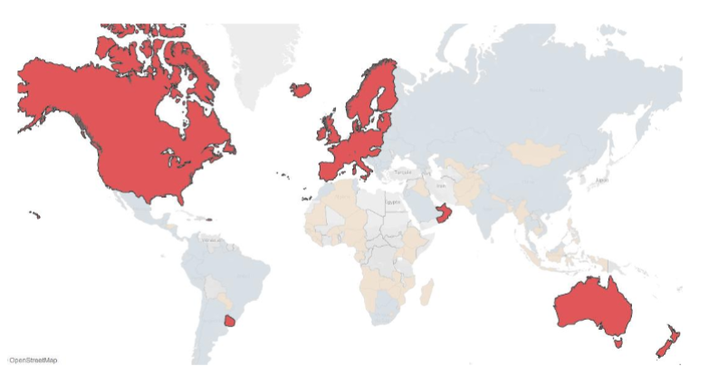

# Projet 11 — La Poule qui chante : segmentation de marchés export par ACP & K-Means

**Contexte :** Pour un exportateur de poulet bio français, segmentation stratégique de 127 pays selon des variables PESTEL (FAO, World Bank, UNDP (Unit. Nat. dev. Prog.)) afin d'identifier les marchés prioritaires pour une stratégie d'export.

**Problématique :** Quels pays constituent des marchés d'export prioritaires, à surveiller, ou non exploitables à court terme pour du poulet bio, et comment affiner cette segmentation à l'intérieur du groupe des marchés matures ?

**Mots-clés :** cadre PESTEL · ACP (analyse en composantes principales) · K-Means · CAH (classification ascendante hiérarchique) · méthode du coude (Elbow) · indice de Calinski-Harabasz · score de Silhouette · re-clustering intra-cluster · normalisation per capita · variance expliquée · segmentation stratégique de marché

**Compétences mobilisées :**

| Domaine                 | Compétence                                                                                                                                  |
|-------------------------|---------------------------------------------------------------------------------------------------------------------------------------------|
| Préparation des données | Réconciliation de noms de pays entre 3 sources hétérogènes (FAO, World Bank, UNDP), gestion des valeurs manquantes                          |
| Feature engineering     | Normalisation per capita pour neutraliser l'effet taille de population                                                                      |
| Choix méthodologique    | Décision assumée de conserver les outliers (richesse informationnelle) plutôt que les exclure                                               |
| Réduction de dimension  | ACP sur 8 variables PESTEL, interprétation économique des axes factoriels principaux (F1 = maturité, F2 = appétence produit)                |
| Clustering              | K-Means avec triangulation de 3 méthodes de choix du nombre de clusters (Elbow, Calinski-Harabasz, Silhouette) + validation croisée par CAH |
| Clustering avancé       | Re-clustering intra-cluster pour lever une hétérogénéité résiduelle non détectée à l'échelle globale                                        |
| Analyse stratégique     | Traduction des clusters en recommandations d'action différenciées (ciblage immédiat / veille / horizon long terme)                          |
| Analytique métier       | Décision méthodologique : k=4 techniquement optimal mais k=3 retenu pour cohérence interprétative et CAH.                                   |

**Outils :** Python (scikit-learn), Tableau Desktop

**Livrable :** Rapport de segmentation en 2 parties (clustering global 127 pays + re-clustering du cluster 1) avec recommandations priorisées, dashboard Tableau

## Illustrations

<table width="100%" style="width:100%;table-layout:fixed;border-collapse:collapse;">
<tr>
<td width="25%" valign="top" style="width:25%;vertical-align:top;padding:4px;"></td>
<td width="25%" valign="top" style="width:25%;vertical-align:top;padding:4px;"></td>
<td width="25%" valign="top" style="width:25%;vertical-align:top;padding:4px;"></td>
<td width="25%" valign="top" style="width:25%;vertical-align:top;padding:4px;"></td>
</tr>
</table>

## Document complet

[Portfolio (PDF)](../pdf/portfolio_keyword_v2.pdf)
