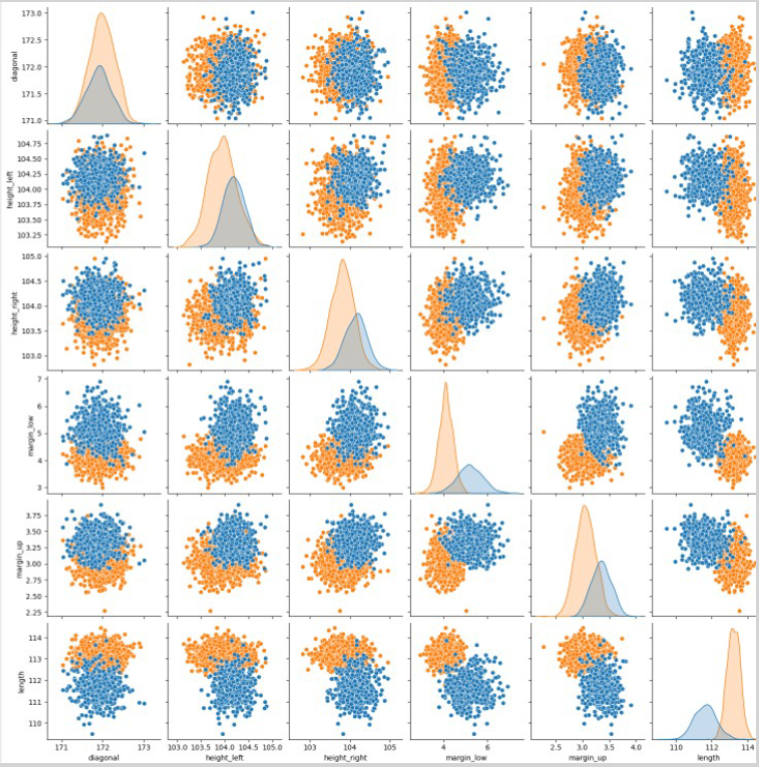
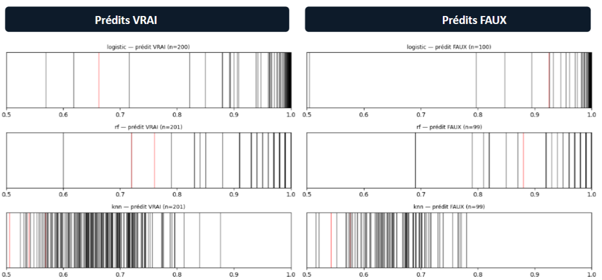

# Projet 12 — ONCFM : détection automatique de faux billets

**Contexte :** Pour l'ONCFM (organisme de lutte contre le faux-monnayage), construction et comparaison de 4 algorithmes de classification sur 1 500 billets labellisés (6 dimensions géométriques), avec système d'indice de confiance pour signaler les cas ambigus.

**Problématique :** Quel algorithme offre le meilleur compromis performance/interprétabilité/déployabilité pour classifier automatiquement des billets, et comment quantifier la fiabilité de chaque prédiction?

**Mots-clés :** classification supervisée/non-supervisée · régression logistique · Random Forest · KNN · K-Means · imputation par médiane · méthode IQR · matrice de confusion · indice de confiance · indépendance des moteurs · stacking / méta-modèle · pair plot · pipeline de production (scaler + modèles sérialisés)

**Compétences mobilisées :**

| Domaine                           | Compétence                                                                                                                                              |
|-----------------------------------|---------------------------------------------------------------------------------------------------------------------------------------------------------|
| Préparation des données           | Imputation ciblée par médiane de groupe, détection d'outliers par IQR sans suppression systématique (choix documenté)                                   |
| Analyse exploratoire              | Pair plot : séparabilité des distributions et corrélation entre classes                                                                                 |
| Machine learning supervisé ou non | Entraînement et comparaison de 4 algorithmes de nature différente (linéaire, ensembliste, local, clustering)                                            |
| Évaluation de modèles             | Accuracy, matrices de confusion, comparaison faux positifs/négatifs par modèle                                                                          |
| Quantification de l'incertitude   | Construction d'indices de confiance par moteur (probabilité, proportion de votes, ratio de distances...), avec évaluation de leur pouvoir discriminant  |
| Statistique avancée               | Une hypothèse de redondance entre K-Means et la régression logistique (dans notre distribution) a conduit a écarter K-means pour le stacking.           |
| Analyse de cas limites            | Diagnostic individualisé des désaccords inter-modèles, identification d'un label toujours mal prédit dans les données sources (erreur de labélisation?) |
| Méthodologie avancée              | Conception d'un pipeline de stacking (méta-modèle), avec split train/test_confiance/test_final et évaluation critique de sa faisabilité.                |
| MLOps / déploiement               | Sérialisation des modèles et du scaler (.pkl), notebook de prédiction en production (predict.ipynb)                                                     |
| Esprit critique                   | Identification explicite des limites (volume, corrélation des moteurs, erreur indétectable à haute confiance)                                           |

**Outils :** Python (scikit-learn, pandas, matplotlib/seaborn)

**Livrable :** Pipeline de notebooks modulaires (split, entraînement ×4, prédiction) + modèles sérialisés + rapport comparatif avec 21 slides

## Illustrations

<table width="100%" style="width:100%;table-layout:fixed;border-collapse:collapse;">
<tr>
<td width="25%" valign="top" style="width:25%;vertical-align:top;padding:4px;"></td>
<td width="25%" valign="top" style="width:25%;vertical-align:top;padding:4px;"></td>
<td width="25%" style="width:25%;"></td>
<td width="25%" style="width:25%;"></td>
</tr>
</table>

## Document complet

[Portfolio (PDF)](../pdf/portfolio_keyword_v2.pdf)
